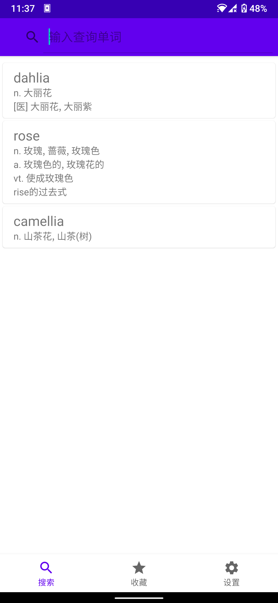
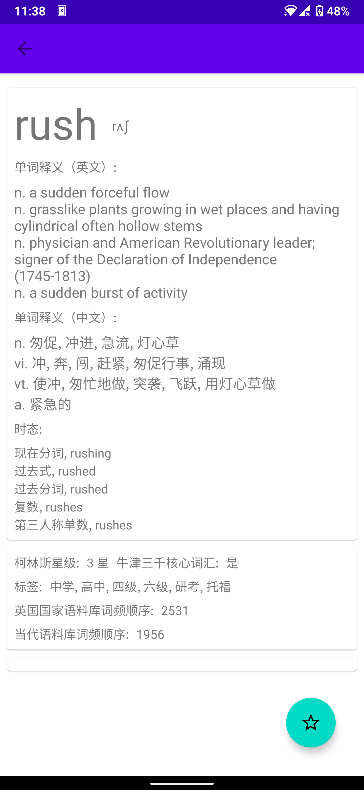
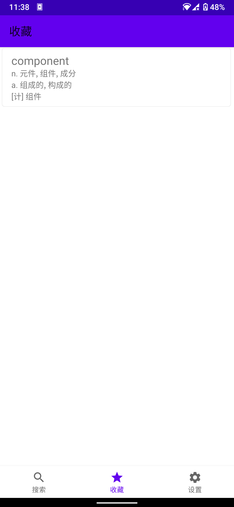
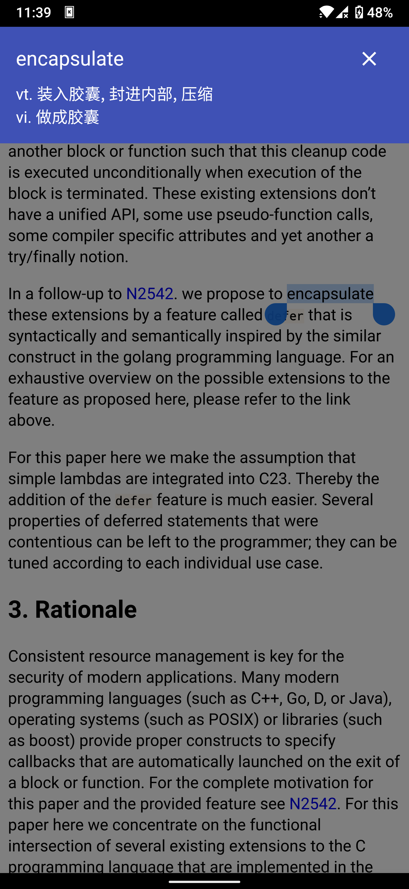

# Easydict

A dictionary that works out of box

## Features

- Basic dictionary functions, query word, show the definition and translation
- Show the query history
- "Favorite" words
- Tap and query
- ...

## Screenshot

| main ui | result page | favorite page | tap and query |
| - | - | - | - |
|  |  |  |  |

## Acknowledgment

- [skywind3000/ECDICT](https://github.com/skywind3000/ECDICT)
- [Android Jetpack](https://developer.android.google.cn/jetpack?hl=zh-cn) 
- [papirus-icon-theme](https://github.com/PapirusDevelopmentTeam/papirus-icon-theme)
- And more

## License

```plaintext
Copyright (c) 2022 chen_null
easydict is licensed under Mulan PSL v2.
You can use this software according to the terms and conditions of the Mulan PSL v2.
You may obtain a copy of Mulan PSL v2 at:
         http://license.coscl.org.cn/MulanPSL2
THIS SOFTWARE IS PROVIDED ON AN "AS IS" BASIS, WITHOUT WARRANTIES OF ANY KIND,
EITHER EXPRESS OR IMPLIED, INCLUDING BUT NOT LIMITED TO NON-INFRINGEMENT,
MERCHANTABILITY OR FIT FOR A PARTICULAR PURPOSE.
```
